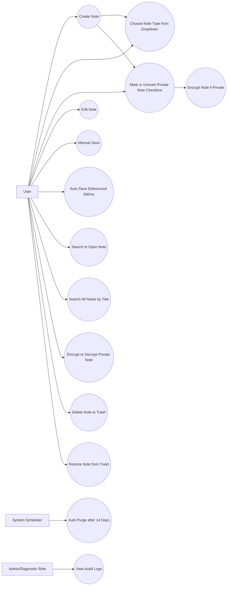
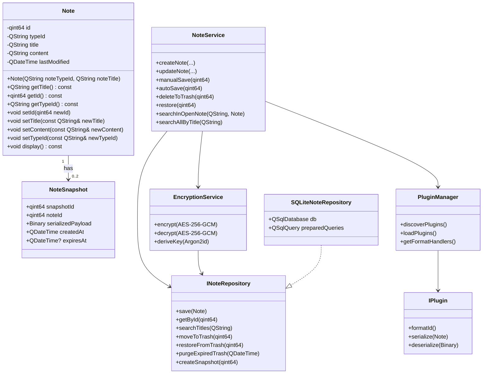
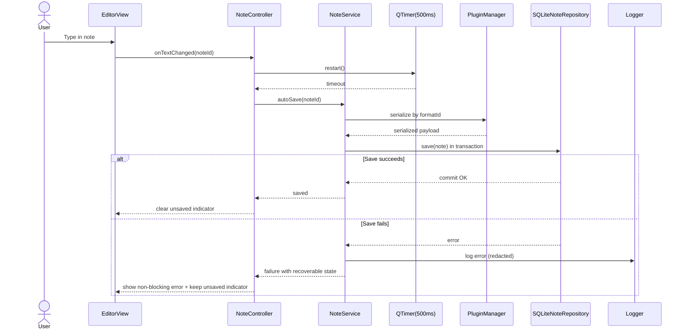
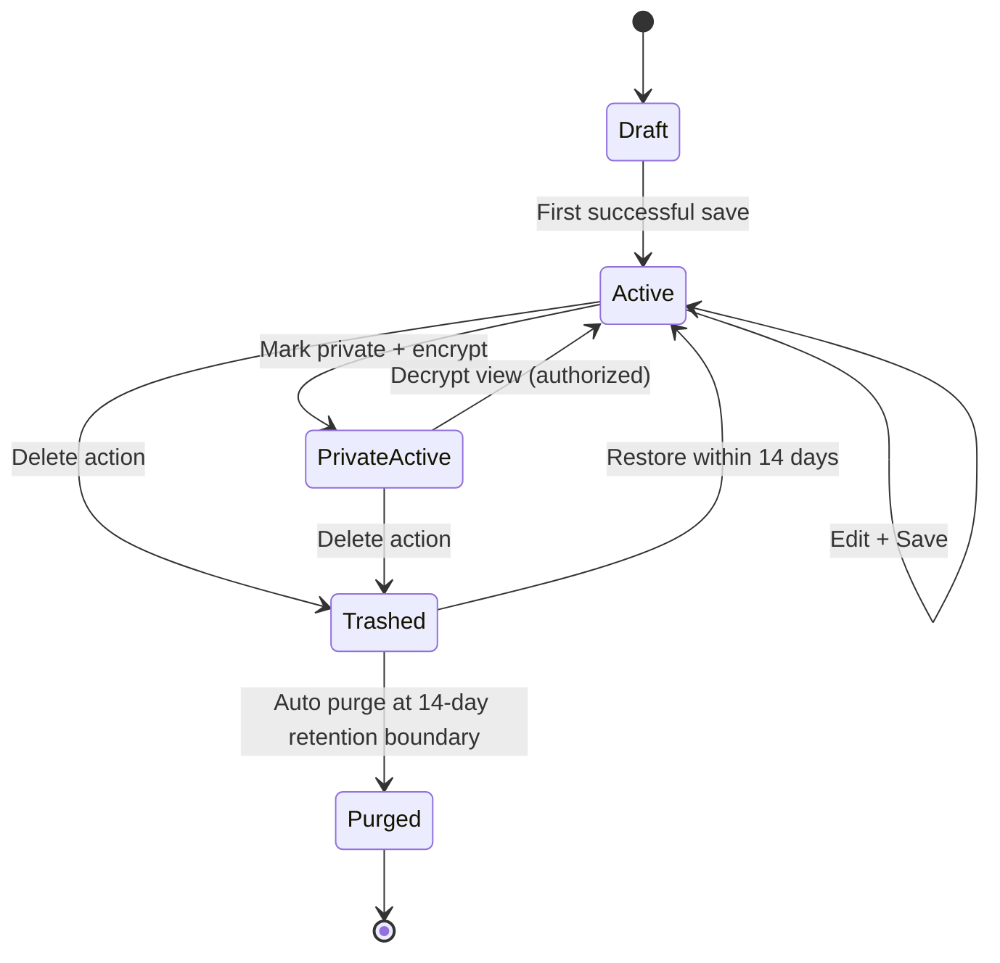
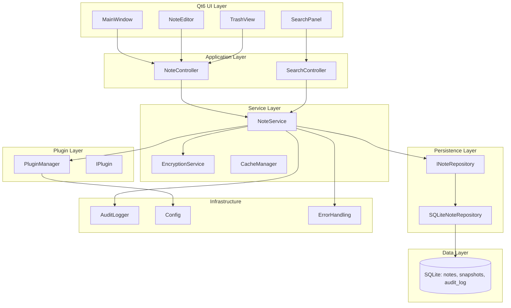
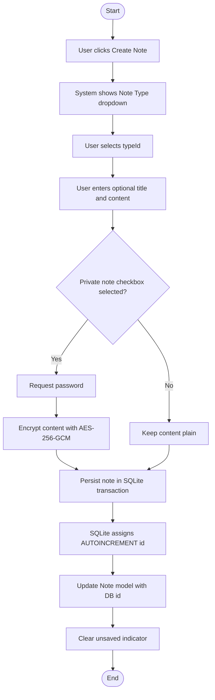
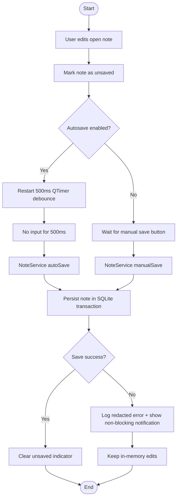
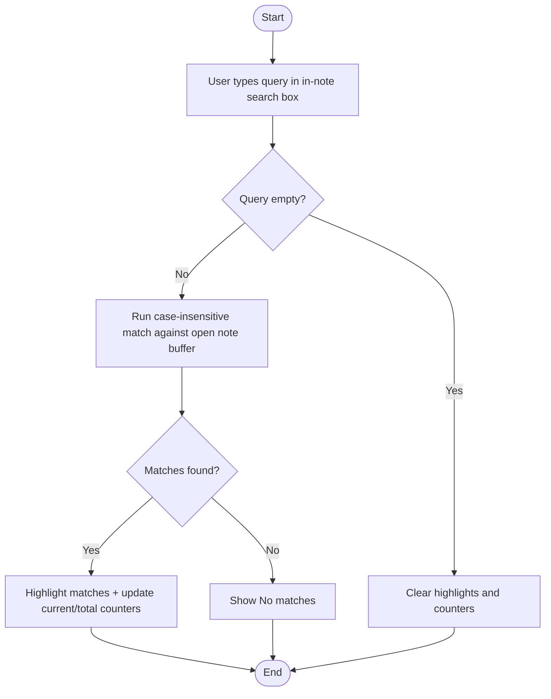
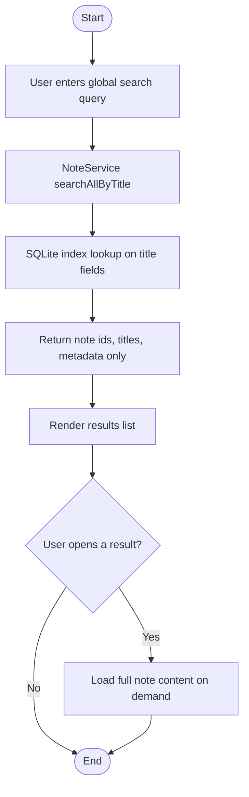
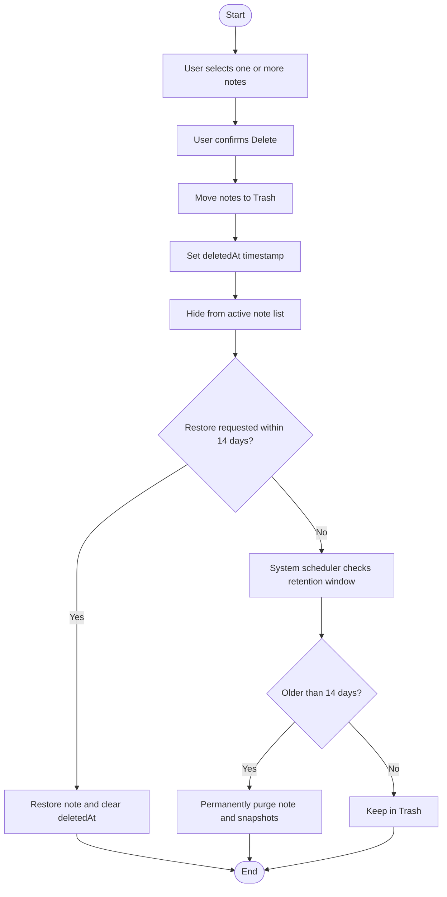

# AstraNotes UML Starter Diagrams

**Date**: April 20, 2026  
**Purpose**: Initial UML baseline aligned to `INITIAL_REQUIREMENTS.md`, `REQUIREMENTS_UPDATED.md`, `USER_STORIES.md`, and `ARCHITECTURE.md`.

---

## 1. Use Case Diagram (Core Scope)



---

## 2. Class Diagram (Domain + Services + Persistence)



---

## 3. Sequence Diagram (Edit + Debounced Autosave + Failure Handling)



---

## 4. State Diagram (Note Lifecycle + Trash Retention)



---

## 5. Component Diagram (Layered Runtime)



---

## 6. Deployment Diagram (Desktop Runtime)

```mermaid
flowchart TB
  User[User]

  subgraph Device[User Workstation (Windows/macOS/Linux)]
    subgraph Proc[AstraNotes Process]
      EXE[AstraNotes Executable]
      QtUI[Qt6 UI Module]
      NoteSvc[NoteService]
      EncSvc[EncryptionService]
      PluginMgr[PluginManager]
      Repo[SQLiteNoteRepository]
    end

    subgraph FS[Local File System]
      DB[(notes.db\nSQLite WAL Mode)]
      WAL[(notes.db-wal)]
      SHM[(notes.db-shm)]
      PLUGINS[plugins/\nText, Voice, Secure, Custom]
      LOGS[logs/\naudit + app logs]
      CONFIG[config/settings.json]
    end
  end

  User --> QtUI
  QtUI --> NoteSvc
  NoteSvc --> EncSvc
  NoteSvc --> PluginMgr
  NoteSvc --> Repo

  PluginMgr --> PLUGINS
  Repo --> DB
  DB --> WAL
  DB --> SHM
  NoteSvc --> LOGS
  QtUI --> CONFIG
```

Deployment notes:
- This diagram models the current offline-first architecture with all persistence on the user workstation.
- IDs are generated by SQLite (AUTOINCREMENT) and assigned back to model objects after insert.
- Plugins are loaded dynamically from `plugins/` at runtime.

---

## 7. Activity Diagrams (User Workflows)

### 7.1 Create Note (Type Selection + Optional Privacy)



### 7.2 Edit Note + Debounced Autosave



### 7.3 Search Within Current Open Note



### 7.4 Search Across All Notes (Title-Only)



### 7.5 Delete to Trash, Restore, and Auto Purge



---

## 8. Modeling Notes and Next UML Iteration

- Current diagrams assume global search is title-only for scale and memory safety.
- Delete flow models trash retention with auto purge at 14 days.
- Governance controls included in behavior: redacted logging and non-blocking error notifications.
- AI integration is intentionally excluded from UML scope for now.

Next diagram candidates:
1. Detailed ER diagram for notes, tags, snapshots, audit logs
2. Plugin lifecycle activity/sequence diagram (discover, load, fail-safe fallback)
3. Concurrency sequence diagram (same note edited in two windows)
4. Packaging and installer deployment variants per OS
