# AstraNotes UML Reference Diagrams

**Date**: June 4, 2026
**Purpose**: Current UML reference aligned to `INITIAL_REQUIREMENTS_REVISED.md`, `USER_STORIES.md`, and `ARCHITECTURE.md`.

---

## 1. Use Case Diagram (Core Scope)

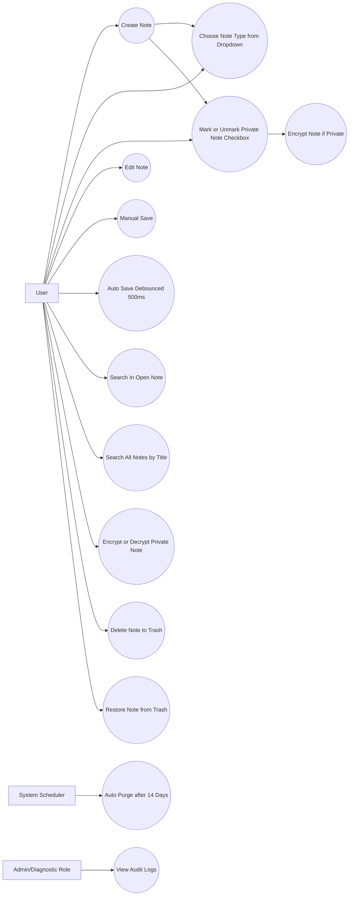

---

## 2. Class Diagram (Current Runtime Model)

```mermaid
classDiagram
  class INote {
    <<interface>>
    +noteId() qint64
    +typeId() QString
    +title() QString
    +content() QString
    +createdAt() QDateTime
    +lastModified() QDateTime
    +setNoteId(qint64)
    +setTypeId(QString)
    +setTitle(QString)
    +setContent(QString)
    +setCreatedAt(QDateTime)
    +setLastModified(QDateTime)
    +displayText() QString
  }

  class Note {
    +qint64 m_noteId
    +QString m_typeId
    +QString m_title
    +QString m_content
    +QDateTime m_createdAt
    +QDateTime m_lastModified
    +bool m_isSecured
    +QString m_encryptionSalt
    +QString m_encryptionIv
    +QString m_encryptionTag
  }

  class ISnapshot {
    <<interface>>
    +snapshotId() qint64
    +noteId() qint64
    +title() QString
    +content() QString
    +createdAt() QDateTime
    +setSnapshotId(qint64)
    +setNoteId(qint64)
    +setTitle(QString)
    +setContent(QString)
    +setCreatedAt(QDateTime)
  }

  class Snapshot {
    +qint64 m_snapshotId
    +qint64 m_noteId
    +QString m_title
    +QString m_content
    +QDateTime m_createdAt
    +bool m_isSecured
    +QString m_encryptionSalt
    +QString m_encryptionIv
    +QString m_encryptionTag
  }

  class INoteRepository {
    <<interface>>
    +save(Note)
    +getById(qint64)
    +getById(qint64, QString)
    +getAll()
    +deleteById(qint64)
    +searchByTitle(QString)
    +searchByContent(QString)
    +saveSnapshot(Snapshot)
    +getSnapshotsByNoteId(qint64)
    +getSnapshotById(qint64)
    +trashNote(qint64)
    +restoreNote(qint64)
    +purgeTrashedNotes(int)
    +searchByTitlePaged(QString, int, int)
  }

  class SqliteNoteRepository {
    +QSqlDatabase db
    +save(Note)
    +getAll()
    +searchByTitlePaged(QString, int, int)
    +trashNote(qint64)
    +restoreNote(qint64)
  }

  class INoteService {
    <<interface>>
    +loadNote(qint64, QString)
    +saveNote(Note, QString)
    +createNote(QString, QString)
    +searchByTitlePaged(QString, int, int)
    +trashNote(qint64)
    +loadNoteRobust(qint64, QString)
  }

  class NoteService {
    +kMaxTitleCharacters
    +kMaxContentBytes
    +loadNote(qint64, QString)
    +saveNote(Note, QString)
    +createNote(QString, QString)
    +searchByTitlePaged(QString, int, int)
    +trashNote(qint64)
  }

  class ISnapshotService {
    <<interface>>
    +saveSnapshot(Note, QString)
    +getSnapshotsByNoteId(qint64)
    +getSnapshotById(qint64, QString)
    +deleteSnapshot(qint64)
    +enforceSnapshotLimit(qint64, int)
    +revertToSnapshot(Note, qint64, QString)
  }

  class SnapshotService {
    +saveSnapshot(Note, QString)
    +getSnapshotsByNoteId(qint64)
    +getSnapshotById(qint64, QString)
    +revertToSnapshot(Note, qint64, QString)
  }

  class ITrashService {
    <<interface>>
    +trashNote(qint64)
    +restoreNote(qint64)
    +purgeNote(qint64)
    +purgeOldTrashedNotes(int)
    +getTrashedNotes(int, int)
    +countTrashedNotes()
    +isNoteTrashed(qint64)
  }

  class TrashService {
    +trashNote(qint64)
    +restoreNote(qint64)
    +purgeNote(qint64)
    +getTrashedNotes(int, int)
  }

  class IFormattingAction {
    <<interface>>
    +actionId() QString
    +actionName() QString
    +actionToolTip() QString
    +actionIcon() QIcon
    +execute(QTextEdit*)
  }

  class IPlugin {
    <<interface>>
    +formatId() QString
    +displayName() QString
    +serializeMetadata(INote)
    +serializePayload(INote)
    +deserialize(QVariantMap, QByteArray, INote)
    +supportsMarkdown() bool
    +supportsPlaintext() bool
    +getFormattingActions()
  }

  class PlaintextPlugin {
    +formatId() QString
    +displayName() QString
  }

  class MarkdownPlugin {
    +formatId() QString
    +displayName() QString
  }

  class PluginManager {
    +instance() PluginManager&
    +registerPlugin(IPlugin*)
    +getPlugin(QString) IPlugin*
    +availableFormats() QStringList
  }

  class EncryptionService {
    +encrypt(...)
    +decrypt(...)
    +deriveKey(...)
  }

  class AuditLogger {
    +instance() AuditLogger*
    +install()
    +logFilePath() QString
  }

  class NoteListController {
    +reload()
    +trashSelectedNotes()
    +noteSaved(Note*)
  }

  class AuditLogPanel
  class TrashDialog

  class MainWindow {
    +MainWindow(QWidget*)
    +~MainWindow()
    +saveCurrentNote(bool)
    +showSnapshotHistoryDialog()
    +showTrashDialog()
    +showSettingsDialog()
  }

  Note ..|> INote
  Snapshot ..|> ISnapshot
  SqliteNoteRepository ..|> INoteRepository
  NoteService ..|> INoteService
  SnapshotService ..|> ISnapshotService
  TrashService ..|> ITrashService
  PlaintextPlugin ..|> IPlugin
  MarkdownPlugin ..|> IPlugin

  INoteRepository --> INote
  INoteRepository --> ISnapshot
  INoteService --> INote
  ISnapshotService --> ISnapshot
  ITrashService --> INote
  IPlugin --> INote
  IPlugin --> IFormattingAction

  MainWindow --> INoteRepository
  MainWindow --> INoteService
  MainWindow --> ISnapshotService
  MainWindow --> ITrashService
  MainWindow --> NoteListController
  MainWindow --> AuditLogPanel
  MainWindow --> TrashDialog
  MainWindow --> PluginManager
  MainWindow --> EncryptionService
  MainWindow --> AuditLogger

  NoteListController --> INoteService
  TrashDialog --> ITrashService
  AuditLogPanel --> AuditLogger

  NoteService --> INoteRepository
  SnapshotService --> INoteRepository
  TrashService --> INoteRepository
  SqliteNoteRepository --> EncryptionService
  SqliteNoteRepository --> AuditLogger
  PluginManager --> IPlugin
```

---

## 3. Object Diagram (Representative Runtime Snapshot)

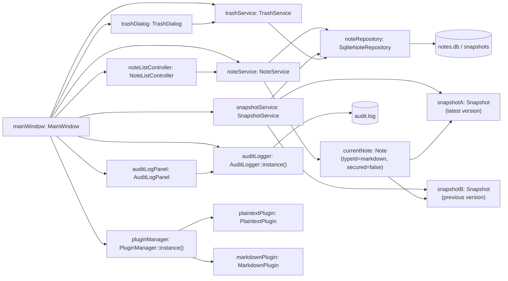

---

## 4. Sequence Diagram (Edit + Debounced Autosave + Failure Handling)

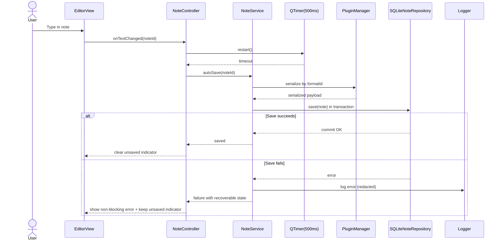

---

## 5. State Diagram (Note Lifecycle + Trash Retention)

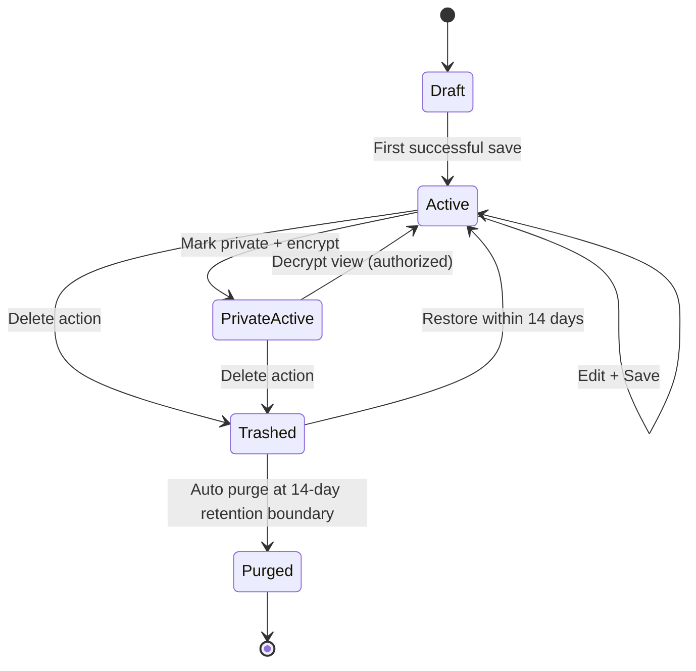

---

## 6. Component Diagram (Layered Runtime)

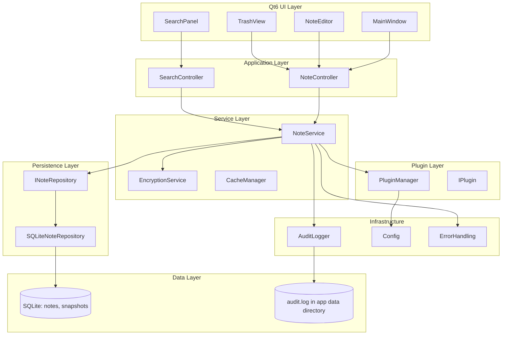

---

## 7. Deployment Diagram (Desktop Runtime)

```mermaid
flowchart TB
  User[User]

  subgraph Device[User Workstation (Windows/macOS/Linux)]
    subgraph Proc[AstraNotes Process]
      EXE[AstraNotes Executable]
      QtUI[Qt6 UI Module]
      NoteSvc[NoteService]
      EncSvc[EncryptionService]
      PluginMgr[PluginManager]
      Repo[SQLiteNoteRepository]
    end

    subgraph FS[Local File System]
      DB[(notes.db\nSQLite WAL Mode)]
      WAL[(notes.db-wal)]
      SHM[(notes.db-shm)]
      PLUGINS[plugins/\nText, Voice, Secure, Custom]
      LOGS[(audit.log in app data directory)]
      CONFIG[config/settings.json]
    end
  end

  User --> QtUI
  QtUI --> NoteSvc
  NoteSvc --> EncSvc
  NoteSvc --> PluginMgr
  NoteSvc --> Repo

  PluginMgr --> PLUGINS
  Repo --> DB
  DB --> WAL
  DB --> SHM
  NoteSvc --> LOGS
  QtUI --> CONFIG
```

Deployment notes:
- This diagram models the current offline-first architecture with all persistence on the user workstation.
- IDs are generated by SQLite (AUTOINCREMENT) and assigned back to model objects after insert.
- Plugins are loaded dynamically from `plugins/` at runtime.
- The audit log is written to the Qt app data location, not a repository-local `logs/` folder.

---

## 8. Activity Diagrams (User Workflows)

### 7.1 Create Note (Type Selection + Optional Privacy)

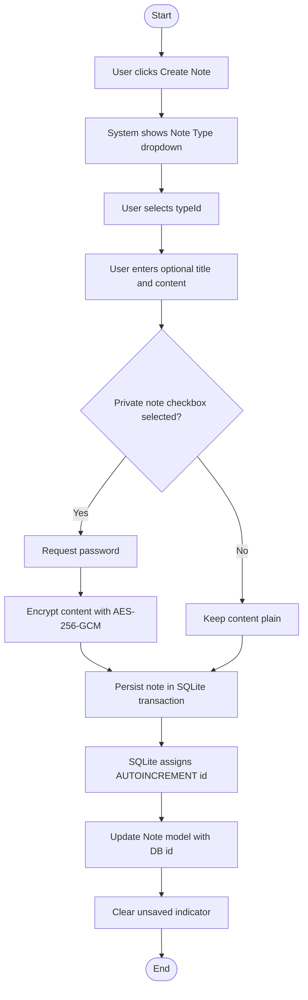

### 7.2 Edit Note + Debounced Autosave

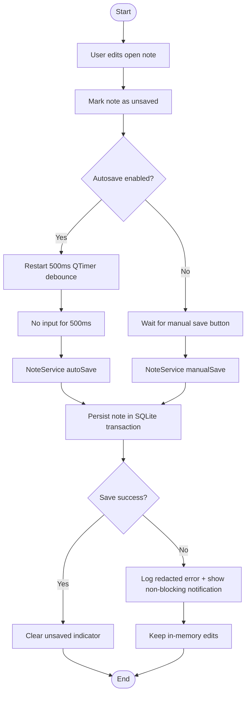

### 7.3 Search Within Current Open Note

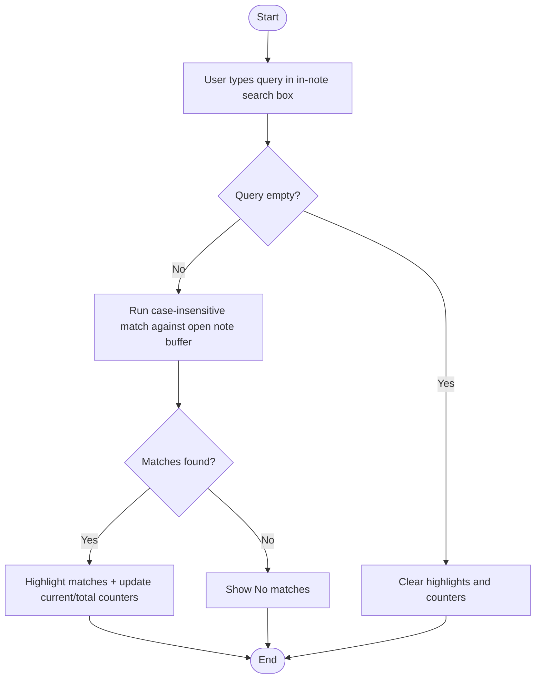

### 7.4 Search Across All Notes (Title-Only)

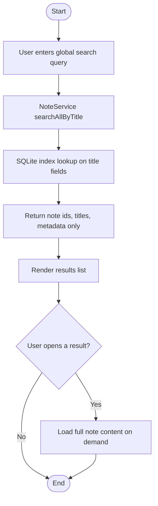

### 7.5 Delete to Trash, Restore, and Auto Purge

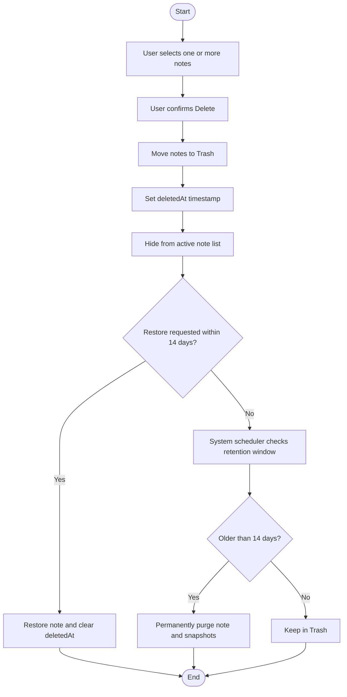

---

## 9. Modeling Notes and Next UML Iteration

- Treat these diagrams as living documentation. Update them when storage locations, service boundaries, or test coverage shift.
- The component and deployment diagrams are the most likely to drift from implementation details.

- Current diagrams assume global search is title-only for scale and memory safety.
- Delete flow models trash retention with auto purge at 14 days.
- Governance controls included in behavior: redacted logging and non-blocking error notifications.
- AI integration is intentionally excluded from UML scope for now.

Next diagram candidates:
1. Detailed ER diagram for notes, tags, snapshots, audit logs
2. Plugin lifecycle activity/sequence diagram (discover, load, fail-safe fallback)
3. Concurrency sequence diagram (same note edited in two windows)
4. Packaging and installer deployment variants per OS
